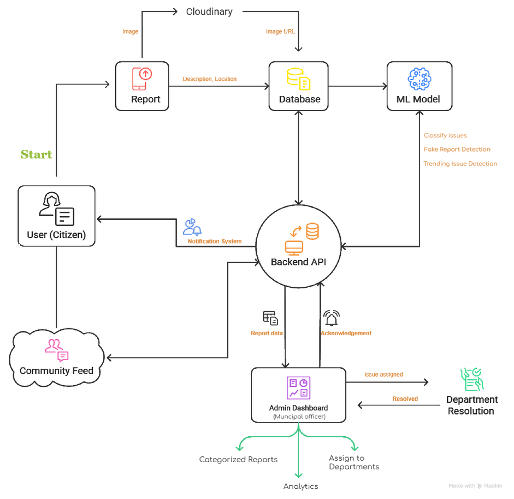

# 🚀 CivicAssist

CivicAssist is a civic engagement platform for reporting and tracking community issues like potholes, garbage, streetlights, etc., with AI-powered moderation and verification.

---

## ❗ Problem

- Delayed reporting of civic issues  
- Lack of transparency in resolution  
- Fake or duplicate complaints  
- Poor communication between citizens and authorities  

---

## 💡 Solution

CivicAssist enables:

- 📷 Easy issue reporting with image & location  
- 🤖 AI-based fake/duplicate detection  
- 📍 Nearby issue tracking (15 km radius)  
- 🏛️ Admin dashboard for efficient management  
- 🔄 Real-time status updates  
- 👥 Community-driven engagement  

---

## 🔄 System Flow



---

## ⚙️ Workflow

1. User reports issue with image + description  
2. Image uploaded to Cloudinary  
3. Data stored in MongoDB  
4. AI model analyzes text + image  
5. Backend processes and stores results  
6. Admin assigns issue to department  
7. Status updated (Pending → In Progress → Resolved)  
8. Community can view and support issues  

---

## 🌟 Unique Features

- 🌐 **Multi-language Support**  
  Users can interact in their **preferred language**, making the platform inclusive and accessible.

- 🎤 **Speech-to-Text Reporting**  
  Report issues using **voice input**, enabling faster and more convenient submissions.

- 👥 **Community Feed**  
  View, support, and engage with issues reported by others — building a **collaborative civic network**.

- 🤖 **AI Chatbot Assistant**  
  Smart assistant that provides **guidance, FAQs, and issue reporting help** in real time.

- 📈 **Trending Issues**  
  Highlights the **most critical and popular problems** in the area for quicker attention.

- 🛡️ **AI Fake Detection**  
  Uses AI to detect **duplicate or false reports**, ensuring data reliability.

- 🏆 **Leaderboard System**  
  Rewards active users and encourages participation through **gamification**.

- 🔥 **Heatmap Visualization**  
  Displays **high-density problem areas** for better decision-making and planning.

- 🏛️ **Smart Department Assignment**  
  Automatically routes issues to the **relevant government departments** for faster resolution.

  

## 🛠️ Tech Stack

- **Frontend**: React 18, Vite, Tailwind CSS, shadcn/ui  
- **Backend**: Node.js, Express  
- **Database**: MongoDB (Mongoose)  
- **Cloud**: Cloudinary  
- **Authentication**: Phone OTP  
- **AI Engine**: Python (PyTorch, Transformers, CLIP)  

---

## 📂 Project Structure
  src/ React frontend
  backend/ Express API
  server.js Entry point
  config/ DB + Cloudinary
  routes/ auth, issues, admin
  models/ Issue, Officer, User
  seed.js Sample data
  ai_engine/ AI scripts
  ai_service/ FastAPI wrapper
  public/ Static assets


---

## 🔐 Environment Variables

Create a `.env` file:


---

## ⚙️ Development

```bash
npm install
npm run dev
